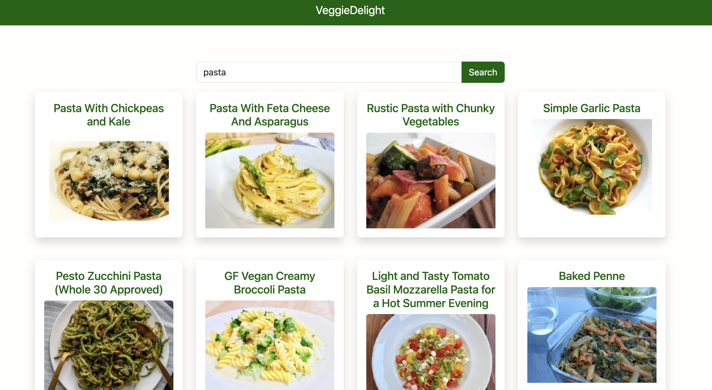

# VeggieDelight

## Explore Recipes with VeggieDelight

[](https://cdn.jsdelivr.net/npm/sweetalert2@11.0.20/dist/sweetalert2.min.js)
[](https://cdn.jsdelivr.net/npm/bootstrap@5.3.2/dist/js/bootstrap.min.js)

- [Overview](#overview)
- [Features](#features)
- [How To Use](#how-to-use)
- [Demo](#demo)
- [Credits](#credits)

## Overview

VeggieDelight is a web application that allows you to explore recipes using the Spoonacular API. It provides a user-friendly interface to search for vegetarian recipes and view detailed information about each recipe.

## Features

- Search for vegetarian recipes by name or ingredients
- Responsive design for seamless use on various devices
- Integration with Sweetalert2 for enhanced user experience
- Utilizes Bootstrap for a modern and clean UI

## How To Use

To use VeggieDelight, follow these steps:

1. Clone this repository:

    ```bash
    git clone https://github.com/francescovitale-dev/VeggieDelight.git
    ```

2. Navigate to the project directory:

    ```bash
    cd VeggieDelight
    ```

3. Install dependencies:

    ```bash
    npm install
    ```

4. Start the application:

    ```bash
    npm start
    ```

5. Access the application through your web browser at http://localhost:3000

## Demo



Check out the live demo of VeggieDelight: [VeggieDelight](https://veggiedelight.netlify.app/)

## Credits

RecipeExplorer utilizes the following technologies, languages, and libraries:

- [React](https://reactjs.org/)
- [Axios](https://github.com/axios/axios)
- [Sweetalert2](https://sweetalert2.github.io/)
- [React Router](https://reactrouter.com/)
- [Bootstrap](https://getbootstrap.com/)
- [Vite](https://vitejs.dev/)

---

> Created by [Your Name](https://www.vitalefrancesco.com) &nbsp;&middot;&nbsp;
> GitHub [Your GitHub](https://github.com/francescovitale-dev)
